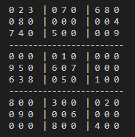
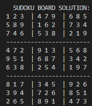

# Sudoku Solver Application

An application that can solve any sudoku problem given to it. Using the backtracking algorithm, this application follows the rules of sudoku to find each missing number. Instead of trying every possible combination of numbers for each box (way too slow), this algorithm chooses an empty square, try all numbers in that square, once it finds one that works it moves to the next empty square, repeats the previous steps until it faces a problem where a number in the row does not work. From here it backtracks to fix the previous squares it encountered. This overall process repeats until the sudoku board is solved.

# Starting Sudoku Board

# Solved Sudoku Board

# References
Tech With Tim (https://www.youtube.com/c/TechWithTim)
